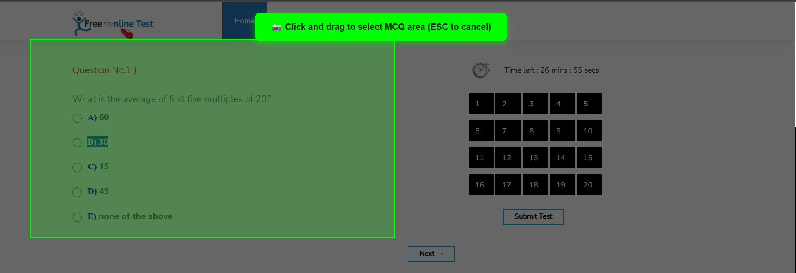
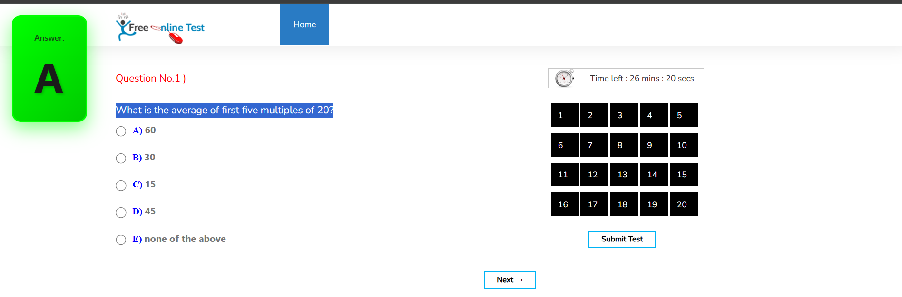

# 🤖 MCQ Screenshot AI - Chrome Extension

AI-powered Chrome extension that automatically solves Multiple Choice Questions (MCQs) using screenshot analysis and Google Gemini 2.5 Flash.


## ✨ Features

- 🎯 **Automatic MCQ Detection** - Analyzes screenshots to identify and solve multiple choice questions
- 📸 **Flexible Capture Modes**
  - **Snippet Selection** - Draw a box around specific question area
  - **Full Screenshot** - Capture entire visible page
- ⚡ **Multiple Activation Methods**
  - **Triple Click** - Quick activation with 3 rapid clicks
  - **Keyboard Shortcut** - Press `Ctrl + Shift + A`
  - **Manual** - Click extension icon
- 🧠 **Powered by Google Gemini 2.5 Flash** - Advanced AI model for accurate answer detection
- 🔍 **OCR Technology** - Extracts text from images using OCR.space API
- 💾 **Persistent Settings** - Your API key and preferences are saved automatically
- 🚀 **Fast Performance** - Optimized with OffscreenCanvas for quick processing

## 📸 Screenshots

### Extension Popup


### Snippet Selection


### Answer Detection


## 🚀 Installation

### Method 1: Developer Mode (Recommended for Testing)

1. **Download the Extension**
   - Download or clone this repository
   - Extract the ZIP file if needed

2. **Open Chrome Extensions Page**
   - Open Google Chrome
   - Navigate to `chrome://extensions/`
   - OR click Menu (⋮) → More Tools → Extensions

3. **Enable Developer Mode**
   - Toggle the **Developer mode** switch in the top-right corner

4. **Load the Extension**
   - Click **"Load unpacked"** button
   - Navigate to the `extention 2` folder
   - Select the folder and click **"Select Folder"**

5. **Verify Installation**
   - The extension should appear in your extensions list
   - Pin it to your toolbar for easy access (click the puzzle icon 🧩)

### Method 2: Manual Installation from CRX (Future)
*Coming soon - Chrome Web Store submission pending*

## 🔑 Getting Your Gemini API Key

The extension requires a **free Google Gemini API key** to function.

### Step-by-Step Guide:

1. **Visit Google AI Studio**
   - Go to [https://aistudio.google.com/apikey](https://aistudio.google.com/apikey)
   - Sign in with your Google account

2. **Create API Key**
   - Click **"Create API Key"** button
   - Select an existing project or create a new one
   - Copy the generated API key

3. **Add to Extension**
   - Open the extension popup
   - Paste your API key in the **"🔑 API Key"** field
   - Click **"💾 Save"** button
   - The key is automatically saved and encrypted in your browser
   - You only need to do this once!

4. **Verify Setup**
   - The status badge should change from "Not Set" to "Configured"
   - Your API key is stored locally and never shared

> **Note**: The Gemini API has a generous free tier with 1,500 requests per day. Perfect for students and casual use!

## 📖 How to Use

### Quick Start

1. **Configure API Key** (First Time Only)
   - Click the extension icon
   - Enter your Gemini API key
   - Click "💾 Save"

2. **Choose Your Preferred Activation Method**
   - **Triple Click Mode**: Just triple-click anywhere on the page
   - **Keyboard Mode**: Press `Ctrl + Shift + A`
   - **Manual Mode**: Click extension icon → "🚀 Start"

3. **Select Question Area**
   - If using Snippet mode: Click and drag to select the MCQ
   - If using Full Screen mode: Entire page is captured automatically

4. **Get Your Answer**
   - The extension will:
     1. 📸 Capture the screenshot
     2. 🔍 Extract text using OCR
     3. 🤖 Analyze with Gemini AI
     4. ✅ Display the answer on screen

### Detailed Usage

#### Snippet Selection Mode
1. Activate the extension (triple-click, shortcut, or manually)
2. Draw a selection box around the question
3. Release to capture
4. Wait for AI analysis (~3-4 seconds)
5. Answer appears as an overlay on the page


#### Full Screenshot Mode
1. Set capture mode to "Full Screen" in settings
2. Activate the extension
3. Entire visible page is analyzed
4. Answer appears on screen


## ⚙️ Settings

### Capture Mode
- **Snippet** - Select specific area (more accurate for single questions)
- **Full Screen** - Capture entire page (good for multiple questions)

### Activation Mode
- **Triple Click** - Fast and convenient (default)
- **Ctrl + Shift + A** - Keyboard shortcut for power users
- **Manual** - Extension icon only (no automatic triggers)

### API Configuration
- **Gemini API Key** - Your personal API key (required)
- Get your key: [https://aistudio.google.com/apikey](https://aistudio.google.com/apikey)
- Stored securely in browser's local storage
- Never transmitted to third parties

## 🛠️ Technical Details

### Architecture
```
User Action (Triple-click/Shortcut/Manual)
    ↓
Content Script (Snippet Selection UI)
    ↓
Background Service Worker
    ↓
Screenshot Capture (Chrome API)
    ↓
Image Cropping (OffscreenCanvas)
    ↓
OCR Processing (OCR.space API)
    ↓
AI Analysis (Google Gemini 2.5 Flash)
    ↓
Answer Display (Content Script Injection)
```

### Technologies Used
- **Chrome Extension Manifest V3**
- **Google Gemini 2.5 Flash API** - AI analysis
- **OCR.space API** - Text extraction
- **OffscreenCanvas** - Fast image processing
- **Chrome Storage API** - Secure settings storage
- **Chrome Scripting API** - Dynamic content injection

### Performance Optimizations
- ⚡ **OffscreenCanvas** for 3x faster image cropping
- 🎯 **ImageBitmap** for hardware-accelerated processing
- 💾 **Lazy loading** of content scripts
- 🔄 **Async/await** for non-blocking operations

## 🔒 Privacy & Security

- ✅ **No data collection** - All processing happens locally or through your own API keys
- ✅ **Secure storage** - API keys stored in browser's encrypted local storage
- ✅ **No tracking** - Extension doesn't send analytics or telemetry
- ✅ **Open source** - Full code transparency
- ✅ **Minimal permissions** - Only requests necessary Chrome APIs

## 🐛 Troubleshooting

### "Please refresh the page" Message
- **Solution**: Refresh the page after installing/updating the extension
- Content scripts only inject into newly loaded pages

### "API key not configured" Error
- **Solution**: Open extension popup and enter your Gemini API key
- Click "💾 Save" to store it
- Get your key at: [https://aistudio.google.com/apikey](https://aistudio.google.com/apikey)

### Cropping Not Working
- **Solution**: Reload the extension in `chrome://extensions/`
- Click the refresh icon next to the extension

### Triple-Click Not Responding
- **Solution**: Check activation mode in settings
- Ensure it's set to "Triple Click"
- Try clicking slightly slower (within 500ms window)

### OCR Not Detecting Text
- **Solution**: Try these steps:
  1. Use higher resolution screenshots
  2. Ensure text is clearly visible
  3. Avoid blurry or low-contrast images
  4. Try Full Screen mode instead of Snippet

## 📋 Requirements

- **Browser**: Google Chrome 88+ or Microsoft Edge 88+
- **API Key**: Free Google Gemini API key ([Get it here](https://aistudio.google.com/apikey))
- **Internet**: Active connection for API calls

## 🤝 Contributing

Contributions are welcome! Here's how you can help:

1. **Report bugs** - Open an issue with detailed reproduction steps
2. **Suggest features** - Share your ideas for improvements
3. **Submit PRs** - Fork, code, and submit pull requests
4. **Improve docs** - Help make the README clearer

## 📄 License

MIT License - feel free to use, modify, and distribute

## 🙏 Acknowledgments

- **Google Gemini AI** - Powering the intelligent answer detection
- **OCR.space** - Providing free OCR API
- **Chrome Extension Team** - For excellent developer tools

## 📞 Support

Having issues? Here's how to get help:

1. Check the **Troubleshooting** section above
2. Open an **Issue** on GitHub
3. Review existing **Closed Issues** for solutions

## 🎓 Educational Use

This extension is designed for:
- ✅ **Learning assistance** - Understanding problem-solving approaches
- ✅ **Study verification** - Checking your own answers
- ✅ **Practice** - Working through example problems

**Please use responsibly and ethically!**

---

Made with ❤️ for students and learners worldwide

**Note**: This is an educational project. Always follow your institution's academic integrity policies.
